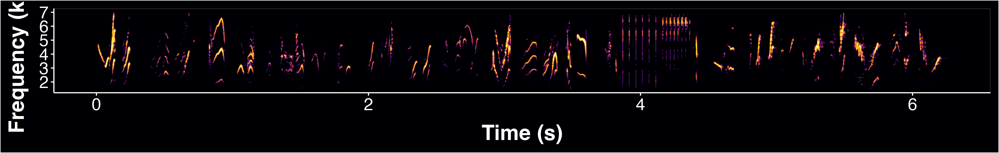

# BARS_song_tattoo
Code for spectrograms for PhD tat. A composite of male barn swallow songs recorded all across the globe and a female barn swallow song recorded in Colorado.

Static spectrogram for tattoo design

Dynamic spectrogram video (with sound)

